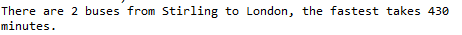
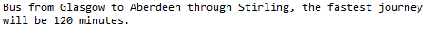

This application takes 2 inputs from the user: start_station and end_station and delivers the fastest route to go from start_station to end_station.

It takes into account the fact a bus going from A to B will also go from B to A.

### The application:
<ul><li> Deal with direct buses (if there are several, the fastest route is given)</li></ul>
<ul><li> Deal with journey with one connection</li></ul>

### Outputs:
<ul><li><strong>Direct bus</strong></li></ul>



<ul><li><strong>Bus with connection</strong></li></ul>




### Code

```python
# Getting inputs from the user (we defined them in the code below for testing purposes)
start_station = 'glasgow'       #input().lower()
end_station = 'london'         #input().lower()


# Bus route data
buses = [{'glasgow':0, 'polmont':30, 'stirling':50}, 
          {'aberdeen':0, 'stirling':70, 'edinburgh':160, 'london':500}, 
          {'dunblane':0, 'polmont':30, 'glasgow':70}, 
          {'london':0, 'polmont':230, 'stirling':470}]


nb = 0
all_times = []
for i in range(len(buses)):
    # Find the stations given as input in the list of buses
    if start_station in buses[i].keys() and end_station in buses[i].keys(): 
        nb = nb + 1 # Counter of the number of buses which are concerned
        time = abs(buses[i][start_station] - buses[i][end_station]) # Duration of the journey
        all_times.append(time)
# Check for connections        
if nb == 0 :
    first_buses = []
    last_buses = []
    all_set = []
    all_set2 = []
    all_time = []
    dic = {}
    for i in range(len(buses)):
        if start_station in buses[i].keys(): 
            first_buses.append(buses[i]) # List with buses which stop at the start_station
            max_time = max(buses[i].values()) # Longest journey for the 1st part of the journey
        if end_station in buses[i].keys(): 
            last_buses.append(buses[i]) # List with buses which stop at the end_station
            max_time_last = max(buses[i].values()) # Longest journey for the 2nd part of the journey
    
    for h in range(len(first_buses)): 
        for x in first_buses[h]:
            all_set.append(x) # Set with stations of the buses which stop at the start_station
    for h in range(len(last_buses)): 
        for x in last_buses[h]:
            all_set2.append(x) #Set with stations of the buses which stop at the end_station
    first_set = set(all_set)
    last_set = set(all_set2)
    for station in first_set.intersection(last_set): # Find the stops to make connections
        min_time = max_time # To make sure we will find the real minimum (1st part of the journey)
        min_time_last = max_time_last # To make sure we will find the real minimum (2nd part of the journey)
        for i in range(len(first_buses)):
            if station in first_buses[i]:
                duration_first_bus = first_buses[i][start_station] - first_buses[i][station]
                if abs(duration_first_bus) < min_time:
                    min_time = abs(duration_first_bus) # Finding the shortest time for the 1st part of the journey     
        for i in range(len(last_buses)):
            if station in last_buses[i]:
                duration_last_bus = last_buses[i][end_station] - last_buses[i][station]
                if abs(duration_last_bus) < min_time_last:
                    min_time_last = abs(duration_last_bus) # Finding the shortest time for the 2nd part of the journey    
        dic[min_time + min_time_last] = station       
        total_time = min_time + min_time_last # Total time of the journey
        all_time.append(total_time) # Will be used in the print() below, printing its min()
    print('Bus from ' +  start_station.capitalize() + ' to ' + end_station.capitalize() + ' through ' +  dic[min(all_time)].capitalize() + ', the fastest journey will be ' + str(min(all_time)) + ' minutes.') 
# Only one direct bus
elif nb == 1:
    print('There is one direct flight from ' +  start_station.capitalize() + ' to ' +  end_station.capitalize() + ' which takes ' + str(all_times[0]) + ' minutes.')
# Fastest direct bus (in case there are several direct buses)
else:
    print('There are ' + str(nb) + ' buses from ' +  start_station.capitalize() + ' to ' +  end_station.capitalize() + ', the fastest takes ' + str(min(all_times)) + ' minutes.')
```
